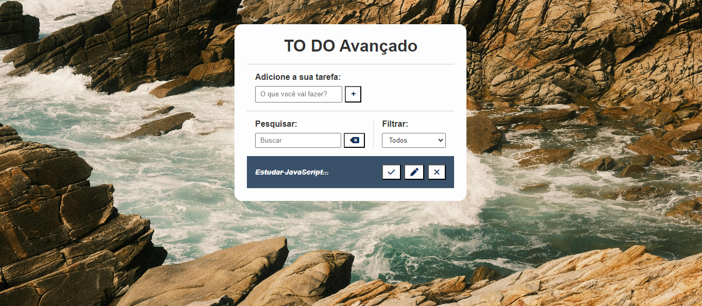

<h1 align="center"> Lista de Tarefas em JavaScript </h1>

Este é um simples projeto de lista de tarefas desenvolvido em JavaScript puro. Ele oferece uma interface intuitiva para adicionar, remover e marcar tarefas como concluídas.

 Funcionalidades
<li> Adicionar novas tarefas: Basta digitar o texto da tarefa na caixa de entrada e pressionar Enter para adicioná-la à lista. </li>
<li> Marcar tarefas como concluídas: Clique na caixa de seleção ao lado de uma tarefa para marcá-la como concluída.</li>
<li> Remover tarefas: Clique no ícone de lixeira ao lado de uma tarefa para removê-la da lista. </li>
<li>Persistência de dados: As tarefas adicionadas permanecem mesmo após atualizar a página, graças ao armazenamento local do navegador. </li>

  <a href="#-tecnologias">Tecnologias</a>&nbsp;&nbsp;&nbsp;|&nbsp;&nbsp;&nbsp;
  <a href="#-projeto">Projeto</a>&nbsp;&nbsp;&nbsp;|&nbsp;&nbsp;&nbsp;
  <a href="#-layout">Layout</a>&nbsp;&nbsp;&nbsp;|&nbsp;&nbsp;&nbsp;
  <a href="#memo-licença">Licença</a>

  

 

  

## 🚀 Tecnologias

Esse projeto foi desenvolvido com as seguintes tecnologias:

- HTML e CSS
- JavaScript
- Git e Github

## 💻 Projeto

O projeto lista de tarefa é uma aplicação para ajudar nas tarefas diárias.

## :memo: Licença

Esse projeto está sob a licença MIT.